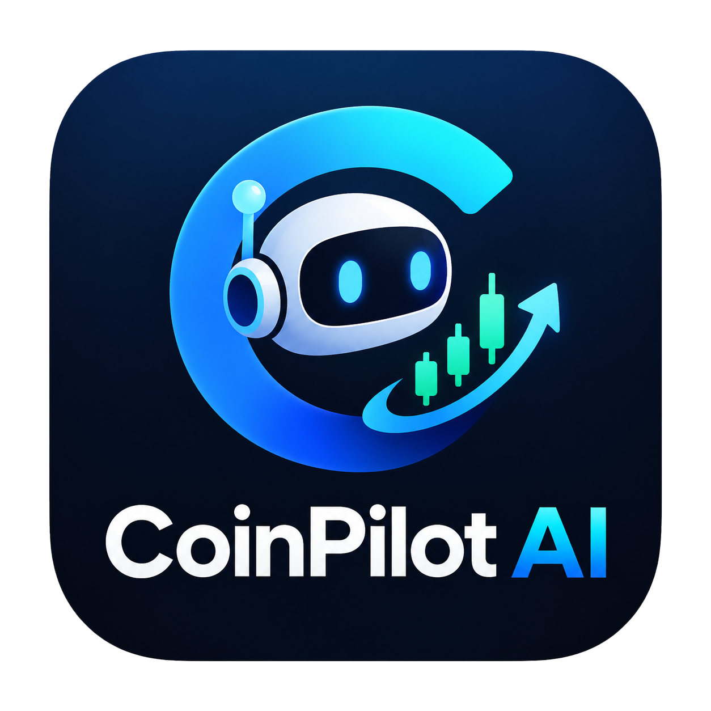

<p align="center">
  
</p>

<h1 align="center">CoinPilot AI · 币航</h1>

<p align="center">
  <strong>桌面上的行情窗口，也是你的交易与复盘工作台。</strong><br />
  从日常盯盘到图表分析，从模拟训练到 AI 复盘，在一个本地工作台里完成。
</p>

<p align="center">
  
  
  
  
  <a href="LICENSE"></a>
</p>

<p align="center">
  <a href="#quick-start">快速开始</a> ·
  <a href="#features">功能指南</a> ·
  <a href="https://github.com/kumuweifengchun-sudo/CoinPilot-AI/releases">下载发行版</a> ·
  <a href="#development">参与开发</a> ·
  <a href="https://github.com/kumuweifengchun-sudo/CoinPilot-AI">项目仓库</a>
</p>

---

## ✨ 币航能做什么

面向个人使用的 Windows 加密交易工作台，把桌面盯盘、规则提醒、人工确认交易、历史训练与 AI 复盘放在一起。默认启动一个 **28 个逻辑像素高的迷你悬浮窗**，需要深入分析时，从托盘打开完整工作台。

| | 能力 | 使用场景 |
| :---: | --- | --- |
| 🪟 | **桌面盯盘** | 悬浮报价、币种轮播、背景明暗适配与快捷隐藏，随时看一眼行情 |
| 📊 | **图表分析** | 多图布局、技术指标、画线与历史行情，按自己的习惯组织工作区 |
| 🔔 | **规则提醒** | 根据行情、指标或账户状态生成事件，辅助人工判断 |
| 🧭 | **交易辅助** | OKX 账户、市价／限价与止盈止损，提交前校验并由用户确认 |
| 🧪 | **历史训练** | 本地模拟、Bar Replay 与指标策略回测，练习并检验交易思路 |
| 📝 | **AI 复盘** | 结合交易记录、统计与数据快照生成分析报告，保留报告来源 |

**公开行情无需 API 密钥。** OKX 账户交易与 AI 服务分别配置、按需使用。当前源码版本以 [pyproject.toml](pyproject.toml) 为准，依赖通过 **uv** 管理。

> **AI 功能进度**：复盘报告与后台事件分析已有实现；工作台左侧 AI 面板仍显示“AI 功能规划中”。AI 没有直接交易权限。

<a id="quick-start"></a>

## 🚀 快速开始

### 选择你的启动方式

| 方式 | 适合谁 | 准备什么 |
| --- | --- | --- |
| [源码运行](#run-from-source) | 想体验源码或参与开发 | Windows、uv、Python 3.13 |
| [安装包](#use-installer) | 想直接在桌面使用 | Releases 中已提供的 Windows 安装包，无需另装 Python |

<a id="run-from-source"></a>

### 从源码运行

准备 Windows、uv 和 Python 3.13，在项目根目录打开 PowerShell：

```powershell
uv sync --locked
uv run --locked coinpilot-ai.py
```

项目要求 Python `>=3.13,<3.14`。开发和构建依赖不会默认安装，分别使用 `--group dev`、`--group build` 启用。

完成后，迷你悬浮窗会出现在桌面。也可以直接打开工作台：

```powershell
uv run --locked coinpilot-ai.py --workbench
```

> **首次运行先检查代理**：默认启用 SOCKS5 `127.0.0.1:7897`。如果本机没有对应代理，请在设置中关闭代理，或改为实际使用的地址。主机与端口分开填写，支持 SOCKS5 和 HTTP。

<details>
<summary><strong>更多启动参数与单实例行为</strong></summary>

常用启动方式：

```powershell
# 启动并打开工作台
uv run --locked coinpilot-ai.py --workbench

# 启动并打开迷你窗口设置
uv run --locked coinpilot-ai.py --settings

# 查看版本和参数
uv run --locked coinpilot-ai.py --version
uv run --locked coinpilot-ai.py --help
```

`--config <路径>` 可指定 JSON 配置文件，`--cache-dir <目录>` 可指定图标缓存目录。同一 Windows 用户的日常源码与 EXE 启动共用单实例锁，重复启动会唤回已有界面。

</details>

<a id="use-installer"></a>

### 使用安装包

若仓库的 [Releases](https://github.com/kumuweifengchun-sudo/CoinPilot-AI/releases) 已提供发行附件，可下载 `CoinPilotAI-Setup-<版本>-x64.exe` 安装，无需另装 Python。安装范围为当前用户，默认目录为 `%LOCALAPPDATA%\Programs\CoinPilotAI`。

安装版支持检查正式发行版、下载更新、校验大小与 SHA-256，并在用户确认后退出并运行安装程序；源码运行可手动检查、下载发行版。手动覆盖安装前，请从系统托盘选择“退出”。

### 第一次使用，建议这样走

1. **看行情** — 检查代理，选择关注币种，熟悉迷你窗口与托盘入口。
2. **搭工作区** — 打开工作台，添加自选、选择图表布局，保存自己的工作区。
3. **先练习** — 体验无需密钥的本地模拟盘，或进入“复盘”进行历史回放与回测。
4. **按需连接** — 配置 OKX 模拟账户或 AI 服务；真实交易需先完成程序要求的模拟盘验收。

<a id="features"></a>

## 🧩 功能指南

### 桌面盯盘与工作区

- 迷你窗口显示币种与报价，支持轮播、置顶、透明度、单击刷新、长按拖动和位置保存；默认 `Alt+Z` 隐藏或恢复，也可设置开机启动。
- 报价数字会根据附近背景明暗自动切换黑白文字，跨越深浅背景时逐位适配；细描边增强复杂背景下的可读性。
- 迷你窗口支持 Binance、OKX、Bybit 和自动选源；工作台图表、提醒及交易使用 OKX 数据。
- 工作台包含“工作台”“复盘”“设置”三页，支持停靠面板和命名工作区，保存布局、自选、图表及扫描筛选状态。
- 分离后的浮动面板独立显示，主窗口最小化、关闭到托盘或切换页面不影响副窗口；可单独关闭、重新停靠，退出程序时统一关闭。
- 关闭工作台只隐藏窗口，隐藏迷你窗口也不会停止后台服务；退出应用后停止监控。

首次仅启动迷你窗口且没有配置账户或启用提醒时，工作台后台行情按需启动；打开工作台后继续保留后台监控。训练与回测页在首次访问时创建，已打开页面的草稿继续保留。验证方法见 [开发细则](docs/development.md#专项验证)。

### 图表与市场分析

- **多图联动**：支持 1、2、4、6 图布局，按需同步品种、周期、十字光标、时间和缩放。
- **图表交互**：历史分页、缩放平移、画线、对象编辑、撤销与状态保存；“跳转”可按本机日期时间定位并加载历史 K 线。
- **常用指标**：MA、EMA、RSI、MACD、BOLL、ATR、VWAP、成交量均线、Stochastic 和 Supertrend。
- **市场扫描**：“自选”侧栏的扫描器覆盖 OKX USDT 永续，支持涨幅、放量、RSI、ATR、突破、均线交叉等筛选与模板保存。
- **盘口与衍生品**：在对应模块查看市场数据；行情缺失、过期或指标预热时，以界面状态为准。

<details>
<summary><strong>K 线周期与时间定义</strong></summary>

K 线周期与 OKX 交易产品接口对齐：

| 范围 | 周期 |
| --- | --- |
| 秒与分钟 | `1s` · `1m` · `3m` · `5m` · `15m` · `30m` |
| 小时 | `1H` · `2H` · `4H` · `6H` · `12H` |
| 日与更长周期 | `1D` · `2D` · `3D` · `5D` · `1W` · `1M` · `3M` |

`6H` 及以上还支持带 `utc` 后缀的 UTC+0 开盘版本，无后缀为 UTC+8 开盘。常用周期直接点击按钮，完整列表在“更多周期”菜单和多图周期下拉框中。周线按周一、月线和季度线按自然日历计算，指标、提醒、回放与回测使用相同定义。`1s` 历史范围受交易所限制，最多查询最近三个月。

周期依据 [OKX 官方文档](https://www.okx.com/docs-v5/zh/) 和公开接口核验（2026-09-29）。

</details>

<details>
<summary><strong>历史缓存与大跨度图表</strong></summary>

历史行情使用独立的数值 SQLite 缓存，主图只保留当前视口和实时尾部。长时间跨度自动切换显示周期并按像素聚合，状态栏标明当前显示周期；历史读写和大范围指标计算在后台完成。图表支持约 525 万个基础周期单位的跨度，具体覆盖取决于缓存与行情源。

</details>

<details>
<summary><strong>复制走势与绘图磁吸</strong></summary>

绘图菜单的“复制走势”可在已加载的历史 K 线上拖选 2—500 根已收盘 K 线，提取收盘价走势线，再移动鼠标到后面的日期单击放置。半透明走势线按首点价格等比叠加，可拖动、编辑透明度、显隐和撤销，不改变实际行情或交易信号。绘图磁吸将锚点吸附到可见 K 线高低点，按住 `Alt` 可临时关闭。

</details>

### 提醒与账户交易

配置提醒规则后，程序根据行情、指标或账户状态生成事件，供人工查看和分析。提醒依赖程序运行及有效数据，不提供云端全天候监控。

| 交易前需要了解 | 说明 |
| --- | --- |
| 支持范围 | 一个 OKX 账户的 **USDT 本位线性永续** |
| 数量单位 | **合约张数** |
| 凭据入口 | “设置 → OKX 账户”，模拟与真实环境分别配置 |
| 交易操作 | 市价／限价下单、开平仓、撤单、止盈止损及杠杆调整 |
| 真实交易解锁 | 默认锁定，需先完成程序要求的 OKX 模拟盘验收；进度可在账户设置中查看 |

提交前，程序检查合约精度、最小数量、账户状态和行情有效性，再由用户确认。订单提交超时或结果未知时，先查询交易所核实，不自动重发。

### 本地模拟与历史训练

| 模式 | 数据与用途 | 与交易所的关系 |
| --- | --- | --- |
| 本地模拟盘 | 使用 OKX 公共行情和合约规格，默认初始资金 100,000 USDT、手续费率 0.05% | 无需 API 密钥，不向交易所提交订单 |
| OKX 模拟盘 | 使用交易所模拟环境，验证账户与交易流程 | 需要模拟环境凭据，验收用于真实交易解锁 |
| Bar Replay | 在“复盘 → Bar Replay · 训练”加载已收盘历史 K 线，逐根或自动推进 | 训练账户与实时账户隔离，不参与真实交易解锁 |
| 策略回测 | 在“复盘 → 策略与回测”配置指标条件、方向及风险参数，下载历史后运行 | 本地计算，不将策略接入自动实盘交易 |

<details>
<summary><strong>订单类型、撮合假设与历史数据边界</strong></summary>

本地模拟与回放支持市价、限价、Stop、Stop Limit、Trailing Stop 等订单类型；OKX 订单表单的支持范围独立校验。模拟采用简化撮合与保证金模型，不完整模拟真实盘口排队、资金费率和强平过程。

回放只向训练会话暴露当前游标以前的数据，可保存进度、训练提醒和交易记录。

回测按已收盘指标产生信号，在下一根 K 线开盘模拟入场，使用手续费与滑点参数；当前为单持仓指标策略，存在历史缺口时拒绝运行。

训练与回测采用磁盘分页历史和增量指标，回测在后台运行；回放旧视口和长区间聚合只读取游标以前的记录。训练与回测结果受数据覆盖和撮合假设限制。

</details>

### AI 分析与交易复盘

支持配置多个 AI 服务，协议包括 OpenAI Responses、OpenAI Chat Completions 和 Anthropic Messages。接口地址、模型、场景及提示词可配置，密钥存入 Windows Credential Manager。

复盘页提供交易记录、统计、资金曲线及按所选数据生成报告的入口。报告保留数据快照、提示词版本、服务／模型与生成时间，便于回看每次分析的依据。

**工作台左侧 AI 面板目前显示“AI 功能规划中”。** AI 配置、复盘与后台事件分析已有实现，该面板的聊天功能尚未完成。AI 没有直接交易权限，未配置 AI 不影响公开行情和手工交易。

交易历史可同步交易所订单、成交与费用，包括本软件之外产生的交易。交易归集和盈亏由程序计算，缺失历史、外部交易及无法归属的费用保留明确标记，AI 不补造缺失事实。

<details>
<summary><strong>可用的提示词变量</strong></summary>

提示词支持以下变量，可在服务配置中按场景组合使用：

| 变量 | 内容 |
| --- | --- |
| `{{context}}` | 完整分析上下文 |
| `{{market}}` | 市场行情 |
| `{{positions}}` | 持仓信息 |
| `{{trades}}` | 交易记录 |
| `{{events}}` | 事件信息 |
| `{{question}}` | 用户问题 |

</details>

<a id="configuration"></a>

## 🗂️ 配置与数据

| 内容 | 默认位置／方式 |
| --- | --- |
| JSON 配置 | `%USERPROFILE%\crypto_widget_settings.json` |
| 图标缓存 | `%USERPROFILE%\crypto_widget_icons\` |
| 工作台数据库 | `%USERPROFILE%\crypto_widget_settings.workbench.sqlite3` |
| OKX 与 AI 密钥 | Windows Credential Manager |
| 开机启动 | 当前用户注册表 `HKCU\Software\Microsoft\Windows\CurrentVersion\Run` 的 `CryptoWidget` 项 |

<details>
<summary><strong>自定义路径、旧版兼容与备份</strong></summary>

配置路径及部分内部标识沿用原 Crypto Widget，以兼容已有数据。自定义 `--config` 时，数据库位于配置文件旁，扩展名替换为 `.workbench.sqlite3`。业务数据库保存工作区、图表、规则、订单、训练记录、提示词和报告等数据。K 线使用同目录的 `.candles-v2.sqlite3` 数值缓存；不迁移旧版行情缓存，首次访问所需历史时会重新获取。

凭据命名空间与数据库路径关联；移动配置与数据库后，需要重新保存凭据。密钥没有明文回退，不应写入普通配置、日志、截图或报告。备份数据库前先正常退出程序，确保 SQLite 的 WAL 数据已处理。

</details>

## 🏗️ 项目结构

应用按桌面、行情、图表、交易、研究与复盘拆分模块，共用本地存储和 UI 基础设施。开发前请先阅读 [开发协作约定](AGENTS.md)。

<details>
<summary><strong>展开目录与模块职责</strong></summary>

```text
coinpilot-ai.py                启动入口
coinpilot_ai/
  application/                应用启动、退出与共享服务编排
  core/                       配置、SQLite、凭据、资源路径及版本
  desktop/                    迷你窗口、托盘、单实例、快捷键及开机启动
  workbench/                  工作台窗口、停靠布局、设置及工作区快照
  market/                     行情、K 线缓存、指标、盘口与衍生品数据
  charts/                     图表绘制、交互、状态与多图布局
  integrations/               OKX 客户端与异步 API 传输
  trading/                    订单校验、交易服务、模拟撮合、提醒与风险计算
  research/                   历史回放、策略回测与市场扫描
  review/                     交易归集、统计、资金曲线与 AI 复盘
  ui/                         共用主题、字体、图标及控件
  updates/                    发行版检查、下载校验及更新界面
  assets/                     应用图标、字体、SVG 及更新安装脚本
tests/                        按功能分组的自动化测试及 integration 集成测试
scripts/
  checks/                     公开接口连通性与代码质量检查
  qa/                         界面渲染、图表基准、模拟盘及启动验证
  release/                    安装包构建与安装器测试
  assets/                     应用图标生成
packaging/windows/            PyInstaller 配置、Windows 清单与 Inno Setup 安装器
pyproject.toml / uv.lock       项目元数据与锁定依赖
AGENTS.md                      开发协作约定
```

</details>

<a id="development"></a>

## 🛠️ 开发与验证

以下命令均在项目根目录执行：

```powershell
uv sync --locked --group dev
uv run --locked --group dev basedpyright
uv run --locked --group dev pytest -q

# 按改动范围运行，例如图表与研究模块
uv run --locked --group dev pytest -q tests/charts tests/research
```

类型检查使用 `pyproject.toml` 中的 `standard` 规则，并禁止缺少类型参数的泛型声明；覆盖应用源码、测试、开发脚本及 `typings/` 本地声明。`typings/` 补充 PyQt6 的 `QTest` 静态函数声明；原生消息的整数返回值及跨线程信号连接保留注明原因的单项声明兼容处理。

日常开发可使用统一入口，类型检查失败时会立即停止，完整入口随后运行回归测试：

```powershell
.\scripts\checks\check_quality.ps1
# 编辑时快速检查类型，交付前仍需完整检查
.\scripts\checks\check_quality.ps1 -TypeOnly
```

新增代码须遵守 [类型定义与对象结构规范](AGENTS.md#类型定义与对象结构)。[GitHub Actions](.github/workflows/quality.yml) 会在推送和 Pull Request 时运行完整质量检查；配置推送到 GitHub 后生效。

<details>
<summary><strong>离线界面验证与性能检查</strong></summary>

测试默认使用 Qt `offscreen` 平台。离线界面验证按需执行，输出写入 `artifacts/`，生成后应实际查看截图：

```powershell
uv run --locked python scripts/qa/verify_ui.py
uv run --locked python scripts/qa/verify_workbench.py
uv run --locked python scripts/qa/verify_paper.py
uv run --locked python scripts/qa/verify_updates.py
uv run --locked python scripts/qa/benchmark_charts.py
uv run --locked python scripts/qa/benchmark_memory.py --output artifacts/performance/mini.json
```

</details>

<details>
<summary><strong>公开接口连通性检查</strong></summary>

公开接口检查会联网，不能替代私有账户、交易或 AI 服务验收：

```powershell
uv run --locked python scripts/checks/check_network.py
uv run --locked python scripts/checks/check_streams.py --direct
uv run --locked python scripts/checks/check_workbench.py --direct
```

`check_streams.py` 与 `check_workbench.py` 支持 `--direct` 直连；省略时使用脚本默认代理。不要用真实账户资金执行自动化测试。

</details>

<a id="release"></a>

## 📦 Windows 打包与发行

构建机需要 64 位 Python 3.13、uv（支持 `uv version`）和 Inno Setup **6.5+ 的 6.x 版本**。双击根目录的 `release.cmd` 即可自动查找 Inno Setup、递增补丁版本并打包；也可以在 PowerShell 中运行：

```powershell
.\release.cmd
```

构建脚本同步锁定依赖、运行安装器安全自检、构建目录版、执行启动检查，并输出安装包与 SHA-256 校验文件：

```text
dist/installer/CoinPilotAI-Setup-<版本>-x64.exe
dist/installer/CoinPilotAI-Setup-<版本>-x64.exe.sha256
```

<details>
<summary><strong>版本递增与构建参数</strong></summary>

```powershell
# 如果自动查找不到 Inno Setup，可手动指定编译器路径
.\scripts\release\build_installer.ps1 -IsccPath "D:\Inno Setup 6\ISCC.exe"

# 次版本递增，例如 0.1.1 -> 0.2.0（主版本使用 major）
.\release.cmd -Bump minor

# 指定更高的版本号，或使用当前版本重新构建
.\release.cmd -Version 1.0.0
.\release.cmd -Bump none
```

默认 `-Bump patch`，例如 `0.1.0 -> 0.1.1`；支持三段或四段数字，每段不超过 65535，递增后清零较低位。`-Version` 与 `-Bump` 不能同时指定。脚本通过 `uv version --no-sync --offline` 同步 `pyproject.toml` 和 `uv.lock`，构建失败会恢复这两个文件；成功后保留新版本。同一仓库同时只能运行一个发行构建。

</details>

<details>
<summary><strong>目录版构建、启动检查与发行验收</strong></summary>

仅构建目录版并检查启动时：

```powershell
uv run --locked --group build pyinstaller --clean --noconfirm packaging/windows/coinpilot-ai.spec
uv run --locked python scripts/qa/smoke_test.py

# 检查已安装版本
uv run --locked python scripts/qa/smoke_test.py --exe "$env:LOCALAPPDATA\Programs\CoinPilotAI\coinpilot-ai.exe"
```

`smoke_test.py` 需要已有 EXE，同时验证源码与 EXE 的启动、退出和重复启动唤回，启动过程可能访问公开行情。目录版 `dist/coinpilot-ai/` 必须整体使用，不能单独复制其中的 EXE。

发行版本以 `pyproject.toml` 为准。修改版本或依赖后同步 `uv.lock`，运行相应测试、构建，并按 [安装验收清单](packaging/windows/installer/VALIDATION.md) 在独立 Windows 用户或虚拟机中验证安装、升级、卸载。

GitHub Release 的标签、安装包版本和源码提交应对应；发布时同时上传安装包及同名 `.sha256` 文件。自动更新读取固定仓库的正式发行版，忽略预发布，不执行降级。构建和启动检查通过不代表安装生命周期已验收。

</details>

## 📌 当前范围

项目面向本地单用户和单 OKX 账户，不提供多交易所下单、Pine Script、无人值守自动实盘交易、云端监控、手机推送或外部控制 API。历史回放和指标回测已实现，功能范围以当前源码及界面为准。

## 📄 开源许可

项目使用 [GNU GPL v3.0](LICENSE)。Lucide 及 Feather 衍生图标保留独立的 [ISC／MIT 许可声明](coinpilot_ai/assets/lucide/LICENSE) 和 [来源说明](coinpilot_ai/assets/lucide/README.md)，字体许可随 `coinpilot_ai/assets/fonts/` 资源保存。

---

<p align="center">
  <strong>CoinPilot AI · 币航</strong><br />
  看行情 · 做训练 · 留记录 · 再复盘<br /><br />
  <a href="#quick-start">开始使用</a> ·
  <a href="#configuration">配置与数据</a> ·
  <a href="#release">构建发行版</a> ·
  <a href="AGENTS.md">开发协作约定</a>
</p>
